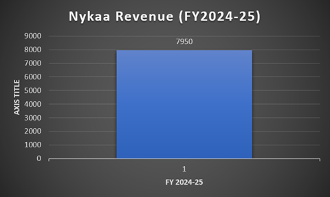

# Nykaa: Can Profitable Growth Continue?

## Executive Summary

This project analyses Nykaa's business model, competitive position, growth strategy, and financial performance using the FY2024–25 Integrated Annual Report and other publicly available information.

The objective is to understand how Nykaa has built a leading position in India's beauty and lifestyle market, identify the factors driving its growth, evaluate its financial performance, and assess whether the company can sustain profitable growth over the long term.

## Business Overview

Nykaa is one of India's leading omnichannel beauty and lifestyle retailers. The company offers beauty, personal care, and fashion products through its digital platforms, physical stores, and business-to-business distribution network.

Its business extends beyond retail by developing and marketing its own portfolio of beauty and fashion brands while partnering with leading domestic and international brands. This combination enables Nykaa to serve customers across multiple shopping channels while strengthening its position in India's growing beauty market.

The company focuses on expanding its customer base, increasing its retail presence, and improving customer experience through technology-driven services and an integrated online-offline shopping model.

## Business Model

Nykaa operates an omnichannel retail model that integrates digital platforms with an expanding network of physical stores. The company generates revenue through multiple business segments, reducing dependence on a single source of income.

### Revenue Sources

- Online beauty and personal care sales
- Online fashion sales
- Offline retail stores, including flagship stores, luxe stores, kiosks, and on-trend stores
- Private-label beauty and fashion brands
- B2B distribution through Superstore by Nykaa

### Business Model Highlights

- Omnichannel presence across online and offline channels
- Curated portfolio of Indian and international brands
- Development of in-house brands to improve margins and strengthen brand ownership
- Technology-driven shopping experience
- Wide distribution network serving both retail customers and business partners

## Competitive Advantages

Nykaa has established a strong competitive position in India's beauty and lifestyle market by combining a focused product strategy with an integrated omnichannel experience.

### Key Competitive Advantages

- **Beauty-focused platform:** Unlike general e-commerce marketplaces, Nykaa specializes in beauty and personal care, helping build customer trust and brand credibility.

- **Extensive brand portfolio:** The platform offers a wide range of domestic and international beauty brands, making it a preferred destination for consumers seeking variety and authenticity.

- **Omnichannel presence:** Customers can discover products online and experience them in physical stores before making purchases, improving customer confidence and engagement.

- **Private-label brands:** Nykaa has developed its own portfolio of beauty and fashion brands, allowing it to strengthen margins while offering exclusive products.

- **Strong brand recall:** Through consistent marketing, influencer collaborations, and customer engagement, Nykaa has become one of the most recognized beauty retail brands in India.

- **Technology-driven platform:** Personalized recommendations, digital shopping tools, and a seamless online experience enhance customer satisfaction and encourage repeat purchases.

## Growth Drivers

Nykaa's growth is supported by expanding consumer demand, a diversified business model, and continuous investments in both digital and physical retail.

### Key Growth Drivers

- **Growing beauty market:** Rising disposable incomes, increasing beauty awareness, and higher spending on premium products continue to expand the addressable market.

- **Expanding customer base:** Nykaa's cumulative customer base has grown significantly, supported by strong customer acquisition and repeat purchases.

- **Retail expansion:** The company has rapidly expanded its physical presence across India, strengthening its omnichannel strategy and improving accessibility.

- **Premiumisation:** Consumers are increasingly shifting towards premium beauty products, resulting in higher average spending per customer.

- **Portfolio expansion:** Nykaa continues to introduce new domestic and international brands while strengthening its own private-label portfolio.

- **Technology and AI:** The company is investing in AI-driven personalisation, customer recommendations, and digital experiences to improve customer engagement and retention.

- **Omnichannel ecosystem:** By integrating online platforms, offline stores, and B2B distribution, Nykaa reaches customers through multiple channels while creating a consistent shopping experience.

## Financial Analysis

Nykaa delivered another year of strong financial performance in FY2024–25, recording growth across revenue, profitability, customer acquisition, and retail expansion.

| Metric | FY2024–25 | YoY Growth |
|---------|----------:|-----------:|
| Revenue | ₹7,950 Cr | 24% |
| EBITDA | ₹474 Cr | 37% |
| Profit After Tax (PAT) | ₹72 Cr | 81% |
| Gross Merchandise Value (GMV) | ₹15,604 Cr | 25% |
| Number of Orders | 62.2 Million | 22% |
| Active Customers | 24 Million | 28% |
| Physical Stores | 237 | 50 new stores added |

### Key Observations

- Revenue grew by **24%**, indicating continued demand across Nykaa's business segments.

- EBITDA increased faster than revenue, suggesting improvements in operating efficiency.

- Profit After Tax increased by **81%**, significantly outpacing revenue growth and indicating stronger profitability.

- Active customers increased by **28%**, demonstrating successful customer acquisition and retention.

- The addition of **50 new stores** strengthened Nykaa's omnichannel strategy while expanding its presence across India.

- GMV crossed **₹15,600 crore**, reflecting continued growth in transaction value across the platform.

### What the Numbers Tell Us

The financial results indicate that Nykaa is entering a phase where profitability is improving alongside business expansion. While revenue growth remained strong at 24%, EBITDA and Profit After Tax grew at a much faster pace. This suggests that the company is becoming more efficient in managing its operating costs while continuing to scale.

The increase in active customers and total orders reflects sustained demand for Nykaa's products and services. At the same time, the addition of 50 new stores demonstrates the company's commitment to strengthening its omnichannel strategy rather than relying solely on online sales.

Growth in Gross Merchandise Value (GMV) further indicates that customers are spending more on the platform, supported by a broader product portfolio and increasing demand for premium beauty products.

Overall, the financial performance suggests that Nykaa is not only expanding its business but also improving the quality of its earnings, making its growth more sustainable over the long term.

### Revenue

Nykaa reported revenue of ₹7,950 crore in FY2024–25, representing a 24% year-on-year increase.

### EBITDA vs PAT

(Chart)

### Customer Growth

(Chart)

### Store Expansion

(Chart)
  
## Risks Analysis

Despite its strong growth, Nykaa faces several challenges that could affect its future performance.

### Key Risks

- **Intense competition:** General e-commerce platforms such as Amazon and Flipkart, along with beauty-focused competitors, continue to compete aggressively on pricing, convenience, and product offerings.

- **Dependence on consumer spending:** A slowdown in discretionary spending could reduce demand for premium beauty and fashion products.

- **Execution risk:** Rapid expansion of physical stores requires efficient inventory management and operational execution to maintain profitability.

- **Dependence on brand partnerships:** Any deterioration in relationships with major domestic or international brands could impact product availability and customer choice.

- **Changing consumer preferences:** Beauty and fashion trends evolve rapidly, requiring continuous innovation and adaptation.

## Investment Thesis

The following factors support Nykaa's long-term growth potential:

- **Leadership in a high-growth industry:** India's beauty and personal care market continues to expand due to rising disposable incomes, premiumisation, and increasing digital adoption.

- **Diversified business model:** Revenue from online retail, offline stores, private-label brands, and B2B distribution reduces dependence on a single business segment.

- **Improving profitability:** EBITDA and Profit After Tax are growing faster than revenue, indicating improving operational efficiency.

- **Strong customer ecosystem:** A growing customer base, high order volumes, and an expanding store network strengthen customer loyalty and support future growth.

## SWOT Analysis

| Strengths | Weaknesses |
|------------|------------|
| Strong brand recognition in beauty retail | Fashion business remains less dominant than beauty |
| Omnichannel presence | High dependence on discretionary consumer spending |
| Wide portfolio of domestic and global brands | Continued investment required for store expansion |
| Growing private-label brands | Lower margins compared to pure premium brands |

| Opportunities | Threats |
|---------------|---------|
| Growth of India's beauty industry | Intense competition from Amazon, Flipkart and other beauty retailers |
| Rising premium beauty demand | Rapidly changing consumer preferences |
| Expansion into Tier-II and Tier-III cities | Economic slowdown affecting discretionary spending |
| Growth of AI-powered customer experience | Price competition and discounting |

## Porter's Five Forces

| Force | Impact | Analysis |
|-------|--------|----------|
| Competitive Rivalry | High | Competition from Amazon, Flipkart, Myntra, Purplle and emerging D2C brands. |
| Threat of New Entrants | Medium | Building customer trust, logistics, and brand partnerships requires significant investment. |
| Bargaining Power of Suppliers | Medium | Global beauty brands have influence, but Nykaa's scale provides negotiating power. |
| Bargaining Power of Customers | High | Customers can easily compare prices and switch between online platforms. |
| Threat of Substitutes | Medium | Offline beauty retailers, brand-owned websites, and other e-commerce platforms provide alternatives. |

## Conclusion

Nykaa has successfully established itself as one of India's leading beauty and lifestyle retailers by combining a focused business strategy with an integrated omnichannel model. The company has demonstrated strong revenue growth, expanding profitability, and consistent customer acquisition while continuing to invest in its physical retail network and technology capabilities.

Its diversified revenue streams, growing portfolio of private-label brands, and strong brand recognition provide a competitive advantage in a rapidly expanding beauty market. At the same time, the company must continue to manage competitive pressures, changing consumer preferences, and the operational challenges associated with rapid expansion.

Overall, Nykaa appears well-positioned to sustain long-term growth, provided it continues to balance expansion with profitability and maintains its focus on customer experience and innovation.

